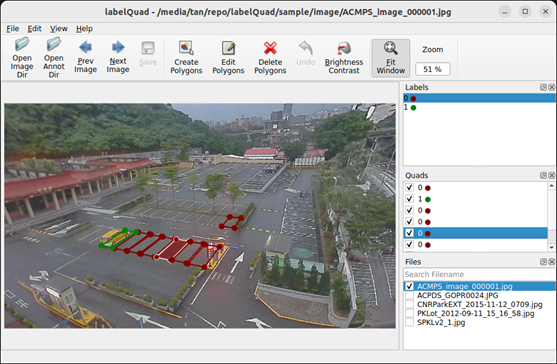

# labelQuad

Labeling tool for images with quadrangle.

<div align="center">
  
</div>

## Requirements

- Python 3.11

## Linux

```bash
python3 -m venv .venv
source .venv/bin/activate
pip install Pillow \
            PyQt5==5.15.11 \
            PyQt5-Qt5==5.15.16 \
            imgviz \
            loguru \
            natsort \
            pyyaml \
            scikit-image
python labelQuad
```

## Windows

```
python -m venv .venv
.\.venv\Scripts\activate
pip install Pillow `
            PyQt5 `
            PyQt5-Qt5 `
            imgviz `
            loguru `
            natsort `
            pyyaml `
            scikit-image
python labelQuad
```

## Acknowledgment

- [labelme](https://github.com/wkentaro/labelme)
